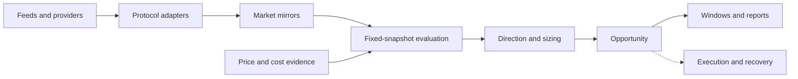

# Vernier

Vernier is an open-source Go framework for cross-chain arbitrage research and
execution. It maintains local market state, quotes against fixed snapshots,
evaluates trade sizes and costs, and records the evidence behind each result.

The repository provides reusable infrastructure rather than a ready-made
strategy. A user supplies the markets, topology, and policy for the setup they
want to study.

## What the project addresses

Comparing prices is only the starting point in cross-chain arbitrage:

- one asset may have a different token representation on each chain;
- a market may use a direct pool, a multi-hop path, or a remote quote source;
- market state changes independently across networks;
- price impact, fees, inventory, and latency can remove an apparent spread;
- a successful transaction does not necessarily prove the expected economic
  settlement.

These distinctions are part of Vernier's domain model. Chain and protocol
details stay in adapters instead of leaking into strategy code.

The long-term aim is to share the same market data, quoting, sizing, and cost
components across Research and Live workflows. Research is used to assess a
strategy and collect evidence. Live adds inventory reservations, durable
operations, transaction management, reconciliation, and recovery.

## Research

Research is currently the most complete workflow. It has no signer or
broadcast path.

At the start of an evaluation, Vernier captures an immutable snapshot of each
market involved. Every quote and sizing point in that evaluation uses those
same versions, even if new events reach the live mirrors in the meantime.

The resulting report identifies:

- the snapshots and quote sources used;
- the direction and sizes evaluated;
- the selected size and its costs;
- the resulting classification;
- any missing or degraded evidence.

Continuous Research can also group related evaluations into
`OpportunityWindow`s, retaining the best observation and the reason the window
closed.

## Core concepts

| Concept | Meaning |
| --- | --- |
| **Asset** | An economic identity, independent of a chain or contract. |
| **Token** | A representation of an asset on a particular chain. |
| **Market** | A quotable way to trade an ordered base/quote pair through a pool, path, or other source. |
| **MarketMirror** | The current local state of a market, including feed health. |
| **MarketSnapshot** | An immutable, versioned view of a mirror used by one evaluation. |
| **Quote** | The expected output for a specific input, together with its source and state evidence. |
| **ArbitrageSetup** | Two markets for the same economic base and quote assets. |
| **Strategy** | The algorithm and policy used to evaluate a setup. |
| **Opportunity** | The result of evaluating a strategy at a particular point in time. |
| **OpportunityWindow** | A sequence of related opportunities observed over time. |
| **SagaPlan** | A dependency graph describing a potential durable execution. |
| **SequentialPlan** | An ordered execution whose next input is the previous stage's confirmed output. |

An `ArbitrageSetup` selects the markets. A strategy determines how to compare
them. A Research profile adds sizing, costs, inventory assumptions, and
recording policy. The same setup can therefore be evaluated under several
policies without duplicating its topology.

## Architecture



The codebase is a modular monolith:

- `domain` contains the economic model;
- `ports` define boundaries for external effects;
- `core` implements market state, strategies, sizing, costing, Research, and
  sagas;
- `adapters` contain chain, protocol, provider, persistence, and notification
  integrations;
- `runtime` assembles those components;
- `cmd` contains the Research and Live entry points and standalone experiments.

Quoting and sizing use local or cached state. Feeds and bootstrap code perform
network I/O outside that decision path.

## Project status

Vernier is pre-release software. Its public API and configuration schema may
still change.

The first packaged milestone is `v0.1.0-alpha.1`. Tagged prereleases contain
Linux and Windows archives with:

- `vernier-research`, the runnable Research CLI;
- `vernier-live`, the disarmed Live entry point and configuration validator.

Both commands support `--version`. The public Live binary cannot broadcast
unless a setup composition is supplied at build time outside the public tree.
Release archives never include environment files, operational databases, or
private configuration.

Implemented or available experimentally:

- a deterministic offline Research example with synthetic events;
- immutable market snapshots, exact arithmetic, sizing, costing, and
  bidirectional two-market strategies;
- local quoting for constant-product and concentrated-liquidity markets;
- read-only EVM and Solana observation;
- multi-hop market snapshots and optional external quote evidence;
- continuous evaluation and explicit handling of feed degradation;
- SQLite persistence for selected opportunity windows;
- inventory, execution allocation, saga, reconciliation, and operational
  persistence primitives;
- a provider-neutral sequential execution kernel for inventory-carrying
  buy, transfer, sell, and return workflows;
- a separate Live entry point that remains disarmed without setup-specific
  private execution components.

Historical replay, wider adapter coverage, public end-to-end Live validation,
rebalancing, Shadow mode, and stable compatibility guarantees are still
outstanding. See [ROADMAP.md](ROADMAP.md) for the delivery sequence.

## Run the offline example

Vernier requires Go 1.25 or newer. The synthetic example needs no endpoint,
account, or external service:

```console
go run ./cmd/research --fixture examples/synthetic/two-market.yaml --format text
```

It processes versioned market events, evaluates both directions, and prints an
auditable report. The fixture format is experimental and is separate from the
modular configuration used for live market observation.

## Configure a private setup

A local setup normally uses three YAML files and one environment file:

```text
config/
`-- my_setup/
    |-- vernier.yaml
    |-- topology.yaml
    `-- policy.yaml
.env.my_setup
```

Both `config/*/` and `.env.*` are ignored by Git.

`vernier.yaml` is the manifest:

```yaml
schema_version: 2
topology: topology.yaml
policy: policy.yaml
active_research: private_research
```

`topology.yaml` defines the parts that describe the markets:

| Section | Contents |
| --- | --- |
| `chains` | Chain type, chain ID, and the names of endpoint environment variables. |
| `assets` | Economic asset identities shared across chains. |
| `tokens` | Chain-specific contracts or public keys, decimals, and symbols. |
| `venues` / `pools` | Protocol adapter and liquidity-source configuration. |
| `paths` | Ordered hops for markets that are not backed by one direct pool. |
| `markets` | Base and quote tokens plus the venue, path, or quote source used. |
| `price_sources` / `quote_sources` | Optional external evidence providers. |
| `transfer_sources` | Named cross-chain capabilities selected by Live policies. |

The private pair is defined in `policy.yaml` by referencing two market IDs:

```yaml
schema_version: 2

setups:
  private_pair:
    markets: [market_alpha, market_beta]

research:
  private_research:
    run_id: private-research
    setup: private_pair
    inventory_mode: prepositioned
    fixed_cost: {asset: quote_asset, amount: "0"}
    min_net_profit: "0"
    sizing:
      kind: linear_range
      asset: quote
      min: "1"
      max: "10"
      samples: 10
```

Live schema v2 composes a compiled execution policy and an inventory profile.
Switching `active_live` changes both without turning YAML into a workflow
language:

```yaml
execution_policies:
  transported:
    kind: transported_sequential
    exit_policy: post_bridge_destination_with_return_fallback
    base_transfer_source: transfer_base
    quote_transfer_source: transfer_quote
  prefunded:
    kind: prefunded_sequential
    exit_policy: destination_first_origin_circuit_breaker
    inventory_restore: immediate_ordered
    base_transfer_source: transfer_base
    quote_transfer_source: transfer_quote

inventory_profiles:
  dual_prefunded:
    kind: prefunded
    balances:
      - {chain: chain_alpha, token: base_alpha, allocation_cap: "10", target: "8", buffer: "1"}
      - {chain: chain_alpha, token: quote_alpha, allocation_cap: "100", target: "80", buffer: "10"}
      - {chain: chain_beta, token: base_beta, allocation_cap: "10", target: "8", buffer: "1"}
      - {chain: chain_beta, token: quote_beta, allocation_cap: "100", target: "80", buffer: "10"}

live:
  prefunded_live:
    run_id: private-live
    setup: private_pair
    run_tier: canary
    execution_policy: prefunded
    inventory_profile: dual_prefunded
    # transaction, risk, account, and persistence policies omitted
```

Both markets must resolve to the same base and quote asset IDs. Their tokens,
chains, protocols, and paths may differ. Endpoints, API keys, and account
values belong in `.env.my_setup` or another secret provider, not in YAML.

For an EVM Live account, `fanout_rpc_urls_env` names an environment variable
whose value is a comma-, semicolon-, or newline-separated RPC list. Vernier
removes exact duplicates, broadcasts the same signed transaction to every
endpoint concurrently, and accepts the first endpoint that returns success or
same-transaction evidence such as `already known`. Each fanout request has a
bounded timeout, so a slow provider cannot block the others. The normal chain
HTTP endpoint remains the sole source for nonce, fees, simulation, and
balances. Fanout endpoints are checked for the expected chain ID at startup
and queried concurrently for receipts after broadcast. The normal HTTP
endpoint is always included in the fanout and exact duplicates are removed.

Every send attempt emits its opaque endpoint index, acceptance status,
classified result, same-transaction evidence, and latency. Endpoint labels are
mapped by their order in the configured list and include only a sanitized
hostname, never an RPC path or API key.

The chain WebSocket subscription is warmed before broadcast. An inbound ERC-20
transfer log provides fast inclusion evidence, while the full receipt remains
the source of gas cost and net wallet deltas. If WebSocket setup or delivery
fails, parallel receipt polling remains active.

The [public reference setup](examples/setups/virtual/) contains a complete EVM
example. It is useful as a schema reference; its topology and policy should not
be treated as defaults for another market.

Run continuous read-only Research for a local setup with:

```console
go run ./cmd/research compare-live --setup my_setup
```

The command bootstraps both configured markets and evaluates accepted feed
updates. It cannot sign or broadcast transactions.

## Execution boundary

Research binaries do not contain a signing or broadcast path. Live is composed
separately and fails closed when its private signer, broadcaster, or
setup-specific execution components are absent.

An armed sequential runtime can be bounded to one admitted operation with
`-once`. This does not change sizing, economic policy, or confirmation input.
The process exits after that operation completes, aborts safely before its
first settlement, or finishes automatic recovery. It does not request a
post-flow reevaluation or run scheduled refuel maintenance:

```text
vernier-live -config /path/to/manifest.yaml -env-file /path/to/environment \
  -arm -confirm-live-input <configured-input> -once
```

A sequential Live policy refers to market and transfer capabilities by stable
IDs rather than naming adapters in the economic plan:

```yaml
live:
  synthetic_sequential:
    setup: synthetic_pair
    execution_mode: sequential_bridge_live
    base_transfer_source: transfer_alpha
    quote_transfer_source: transfer_beta
```

Each transfer source selects a compiled adapter kind in topology and keeps its
endpoint, profile, and environment-variable names outside the domain. Runtime
composition validates that the selected binary actually provides the required
swap, transfer, broadcast, confirmation, and cost capabilities.

An unknown broadcast result is reconciled before any retry is considered.
Technical transaction success and economic settlement are tracked separately.

Reports describe the state and assumptions used by Vernier. They do not show
that an opportunity will still exist, can be executed, or will be profitable.

## Development

The repository has one verification entry point:

```console
go run ./tools/verify
```

Tests and test data live under `tests/`. Public architectural decisions are
recorded in [decisions](decisions/).

Unsolicited pull requests are closed by default. Use an issue for
non-sensitive proposals and follow [SECURITY.md](SECURITY.md) for private
security reports. Further project policy is documented in
[CONTRIBUTING.md](CONTRIBUTING.md) and
[CODE_OF_CONDUCT.md](CODE_OF_CONDUCT.md).

## License

Vernier is licensed under the [Apache License 2.0](LICENSE).
